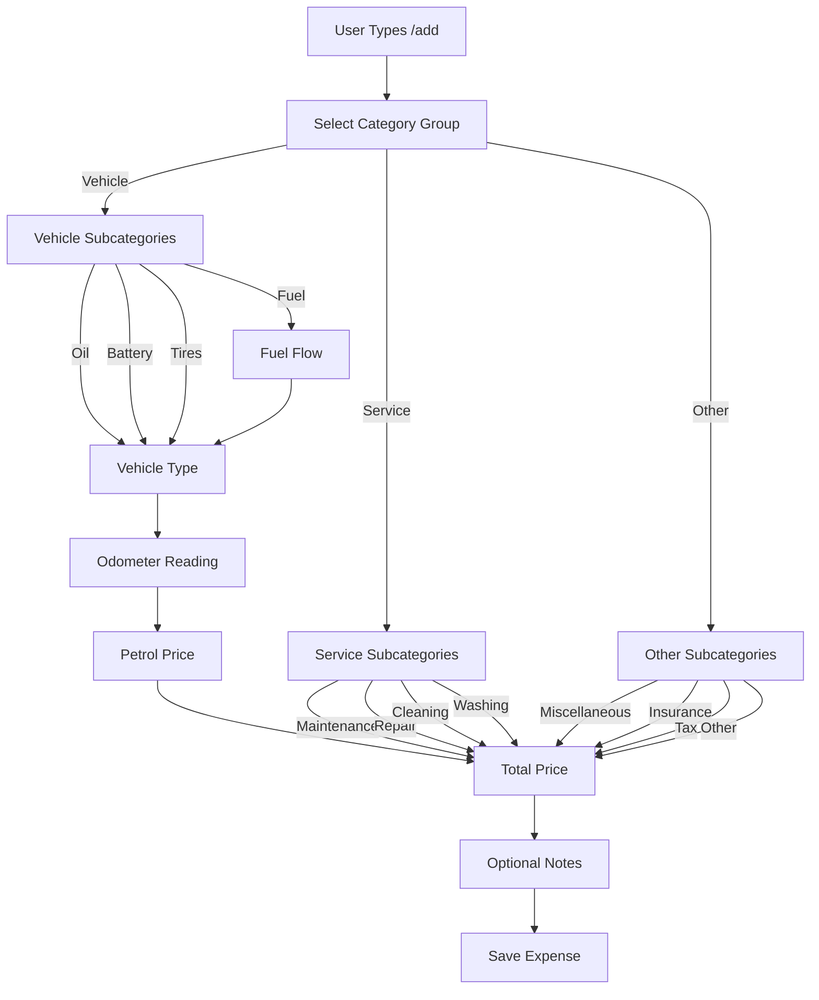

# Add Expense Flow

This diagram shows the workflow for adding a new expense using the `/add` command.

## Flow Description

1. **Category Group Selection**
   - User selects from three main groups: Vehicle, Service, or Other
   - Each group has specific subcategories

2. **Vehicle-related Expenses**
   - For Fuel category:
     1. Enter vehicle type
     2. Enter odometer reading
     3. Enter petrol price
     4. Enter total price
     5. Add optional notes
   - For other vehicle categories (Oil, Battery, Tires):
     1. Enter vehicle type
     2. Enter total price
     3. Add optional notes

3. **Service-related Expenses**
   - Directly enter total price
   - Add optional notes

4. **Other Expenses**
   - Directly enter total price
   - Add optional notes

## Validation Steps

- Odometer reading must be between 0 and 1,000,000 km
- Petrol price must be between ₹0 and ₹200 per liter
- Total price must be between ₹0 and ₹100,000
- Notes are optional and limited to 500 characters

## Error Handling

- Invalid inputs trigger appropriate error messages
- User can retry input or cancel operation
- Rate limiting prevents abuse
