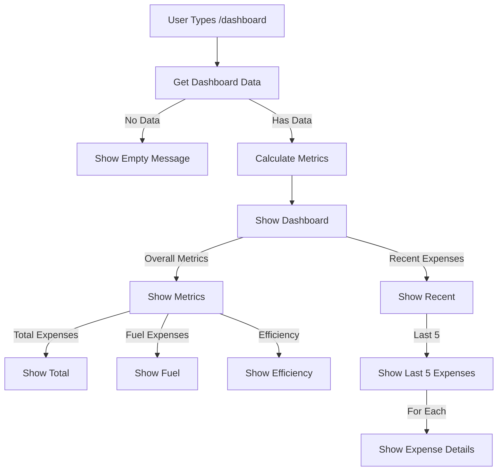

# Dashboard Flow

This diagram shows the workflow for displaying the expense dashboard using the `/dashboard` command.



## Flow Description

1. **Data Collection**
   - User sends `/dashboard` command
   - Bot retrieves recent expenses
   - Calculates key metrics

2. **Dashboard Display**
   - Overall metrics
   - Recent expenses
   - Efficiency calculations

3. **Dashboard Format**

   ```
   📱 Expense Dashboard

   📊 Overall Metrics:
   • Total Expenses: ₹15,700
   • Total Fuel Expenses: ₹8,500
   • Average Fuel Efficiency: 12.5 km/₹100

   🕒 Recent Expenses:
   • 2024-03-15 - Fuel: ₹1,500
   • 2024-03-12 - Maintenance: ₹3,000
   • 2024-03-10 - Fuel: ₹1,200
   • 2024-03-05 - Other: ₹2,000
   • 2024-03-01 - Fuel: ₹1,800
   ```

## Features

- Quick overview of expenses
- Fuel efficiency tracking
- Recent expense history
- Formatted currency display
- Emoji indicators for better readability

## Metrics Calculation

1. **Overall Metrics**
   - Total expenses
   - Fuel expenses
   - Average fuel efficiency

2. **Recent Expenses**
   - Last 5 expenses
   - Chronological ordering
   - Category and amount

3. **Efficiency Calculation**
   - Distance per ₹100 spent
   - Based on odometer readings
   - Only for fuel expenses

## Error Handling

- Database error handling
- Rate limiting
- Empty state handling
- Invalid data handling

## Example Messages

1. **Empty State**

   ```
   No expenses found to show dashboard.
   ```

2. **Error State**

   ```
   ❌ Failed to generate dashboard. Please try again.
   ```

3. **Rate Limit**

   ```
   Too many requests. Please try again later.
   ```
