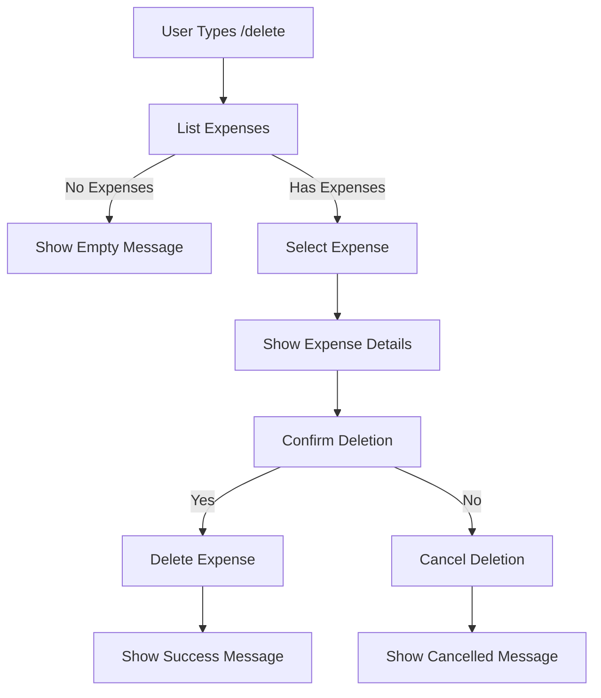

# Delete Expense Flow

This diagram shows the workflow for deleting an expense using the `/delete` command.



## Flow Description

1. **Initial List**
   - User sends `/delete` command
   - Bot shows numbered list of expenses
   - Each entry shows date, category, and amount

2. **Expense Selection**
   - User selects expense by number
   - Bot shows complete expense details
   - User must confirm deletion

3. **Confirmation Process**

   ```sh
   Are you sure you want to delete this expense?
   
   Category: Fuel
   Vehicle Type: Car
   Odometer: 50000
   Petrol Price: ₹95
   Total Price: ₹1500
   Notes: Full tank
   
   [Yes] [No]
   ```

4. **Deletion Process**
   - If confirmed: Delete expense and show success message
   - If cancelled: Return to main menu

## Features

- Complete expense details before deletion
- Confirmation prompt
- Success/failure messages
- Error handling
- Rate limiting

## Error Handling

- Invalid selection handling
- Database error handling
- Rate limit exceeded
- Empty state handling

## Example Messages

1. **List Display**

   ```
   Select an expense to delete:
   
   1. 2024-03-15 - Fuel: ₹1,500
   2. 2024-03-12 - Maintenance: ₹3,000
   ```

2. **Success Message**

   ```
   ✅ Expense deleted successfully!
   ```

3. **Cancellation Message**

   ```
   Operation cancelled.
   ```

4. **Error Messages**

   ```
   ❌ Invalid selection. Please try again.
   ❌ No expenses found to delete.
   ❌ Failed to delete expense. Please try again.
   ```