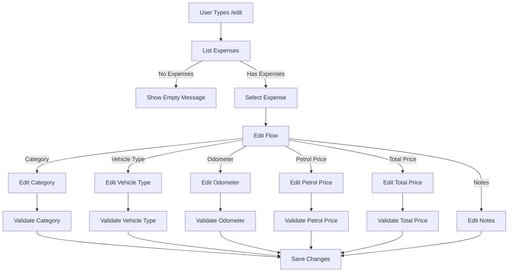

# Edit Expense Flow

This diagram shows the workflow for editing an existing expense using the `/edit` command.



## Flow Description

1. **Initial List**
   - User sends `/edit` command
   - Bot shows numbered list of expenses
   - Each entry shows date, category, and amount

2. **Expense Selection**
   - User selects expense by number
   - Bot shows current expense details
   - User can edit any field or skip

3. **Edit Options**
   For each field:
   - Category
   - Vehicle Type
   - Odometer
   - Petrol Price
   - Total Price
   - Notes

4. **Validation Steps**
   - Category must be valid
   - Odometer: 0-1,000,000 km
   - Petrol Price: ₹0-200
   - Total Price: ₹0-100,000
   - Notes: max 500 characters

## Edit Process

1. **Show Current Values**

   ```
   Current values:
   Category: Fuel
   Vehicle Type: Car
   Odometer: 50000
   Petrol Price: ₹95
   Total Price: ₹1500
   Notes: Full tank
   ```

2. **Edit Prompts**

   ```
   Enter new category (or /skip to keep current):
   Enter new vehicle type (or /skip to keep current):
   Enter new odometer reading (or /skip to keep current):
   Enter new petrol price (or /skip to keep current):
   Enter new total price (or /skip to keep current):
   Enter new notes (or /skip to keep current):
   ```

## Features

- Skip option for each field
- Validation for each input
- Confirmation before saving
- Error handling
- Rate limiting

## Error Handling

- Invalid input detection
- Database error handling
- Rate limit exceeded
- Invalid selection handling
