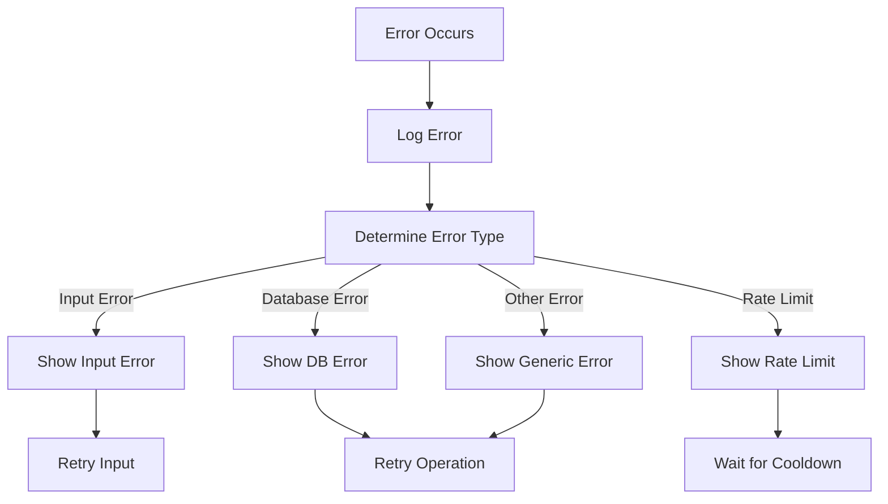

# Error Handling Flow

This diagram shows the workflow for handling various errors in the bot.



## Error Types

1. **Input Errors**
   - Invalid category selection
   - Invalid numeric input
   - Out of range values
   - Invalid date format
   - Empty required fields

2. **Database Errors**
   - Connection failures
   - Query errors
   - Data validation errors
   - Duplicate entries

3. **Rate Limiting**
   - Too many requests
   - Spam prevention
   - API limits

4. **Other Errors**
   - Network issues
   - Timeout errors
   - System errors
   - Unknown errors

## Error Handling Process

1. **Error Detection**
   - Input validation
   - Database operations
   - API calls
   - System operations

2. **Error Logging**
   - Error type
   - Error message
   - Stack trace
   - User context
   - Timestamp

3. **User Communication**
   - Clear error messages
   - Retry instructions
   - Alternative options
   - Support information

## Example Error Messages

1. **Input Errors**
   ```
   ❌ Invalid amount. Please enter a number between 0 and 100,000.
   ❌ Invalid category. Please select from the available options.
   ❌ Notes must be less than 500 characters.
   ```

2. **Database Errors**
   ```
   ❌ Failed to save expense. Please try again.
   ❌ Unable to retrieve expenses. Please try again later.
   ```

3. **Rate Limiting**
   ```
   ⚠️ Too many requests. Please wait a moment and try again.
   ```

4. **Other Errors**
   ```
   ❌ An unexpected error occurred. Please try again.
   ❌ Service temporarily unavailable. Please try again later.
   ```

## Recovery Actions

1. **Input Errors**
   - Show valid options
   - Provide examples
   - Allow retry

2. **Database Errors**
   - Automatic retry
   - Fallback options
   - Cache usage

3. **Rate Limiting**
   - Wait period
   - Queue system
   - Priority handling

4. **Other Errors**
   - Graceful degradation
   - Alternative flows
   - User guidance

## Monitoring and Alerts

1. **Error Tracking**
   - Error frequency
   - Error patterns
   - User impact

2. **Performance Metrics**
   - Response time
   - Success rate
   - Error rate

3. **Alert System**
   - Critical errors
   - Pattern detection
   - User notifications 