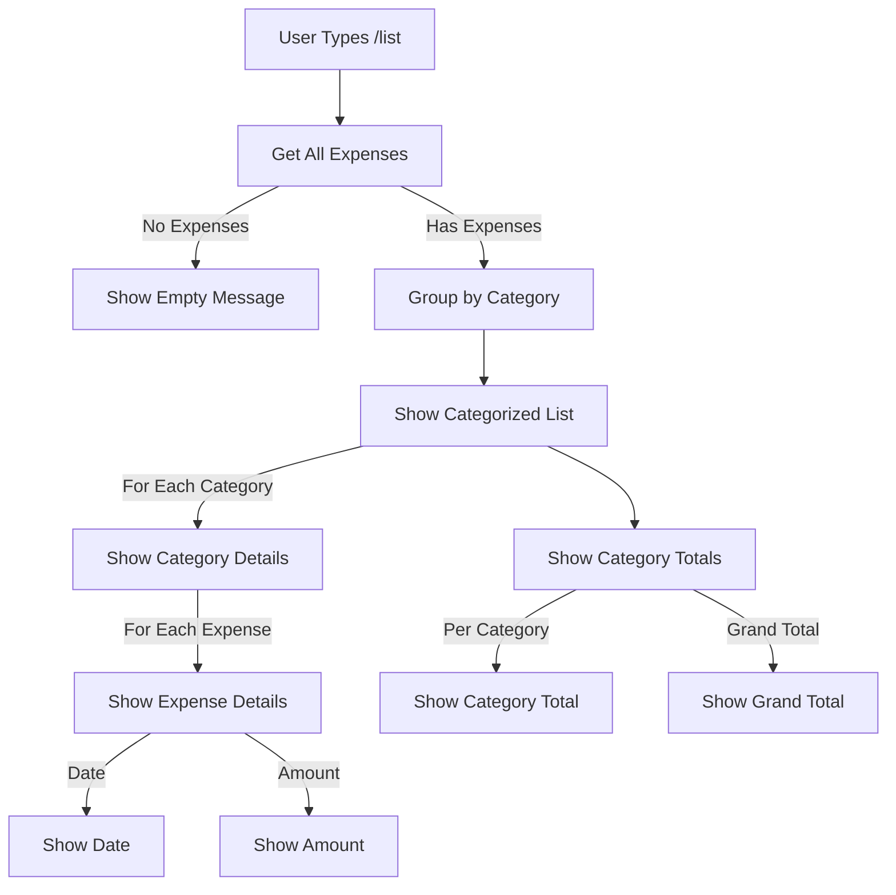

# List Expenses Flow

This diagram shows the workflow for listing expenses using the `/list` command.



## Flow Description

1. **Initial Request**
   - User sends `/list` command
   - Bot retrieves all expenses for the user

2. **Empty Check**
   - If no expenses exist, shows appropriate message
   - If expenses exist, proceeds with grouping

3. **Category Grouping**
   - Groups expenses by category
   - Maintains chronological order within categories

4. **Display Format**
   For each category:

   ```sh
   📊 Category Name:
   • Date: Amount
   • Date: Amount
   ...
   Total: Category Total
   ```

5. **Summary Display**
   - Shows total for each category
   - Shows grand total at the end

## Output Format

```
Your expenses:

📊 Fuel:
• 2024-03-15: ₹1,500
• 2024-03-10: ₹1,200
Total: ₹2,700

📊 Maintenance:
• 2024-03-12: ₹3,000
Total: ₹3,000

Grand Total: ₹5,700
```

## Features

- Chronological ordering
- Category-wise grouping
- Subtotal calculation
- Grand total calculation
- Formatted currency display
- Emoji indicators for better readability

## Error Handling

- Database errors are caught and displayed
- Basic rate limiting prevents abuse
- Empty state handling 