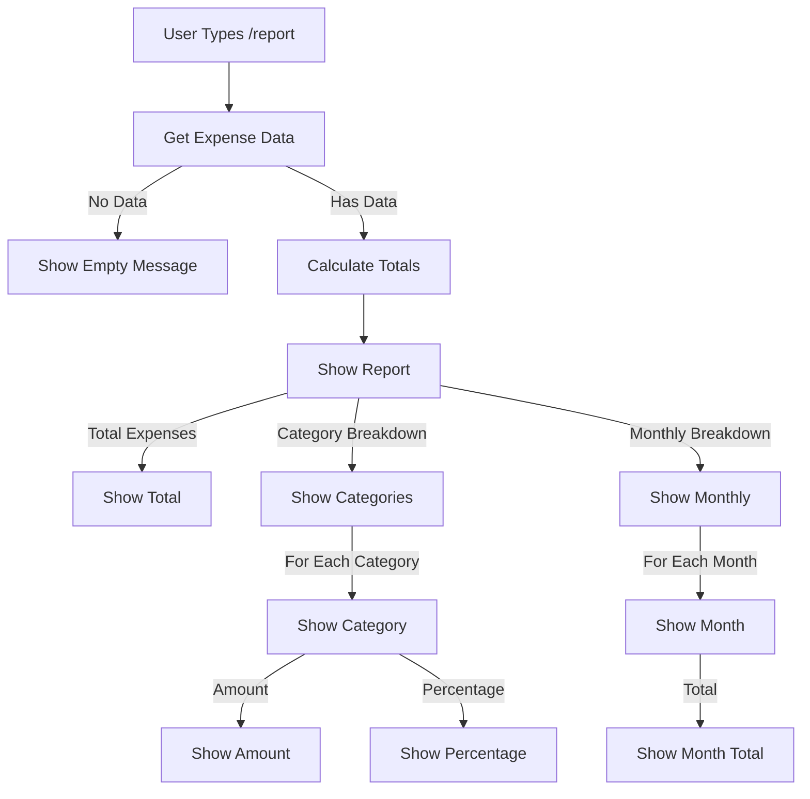

# Report Flow

This diagram shows the workflow for generating expense reports using the `/report` command.



## Flow Description

1. **Data Collection**
   - User sends `/report` command
   - Bot retrieves all expenses
   - Calculates various metrics

2. **Report Generation**
   - Total expenses
   - Category-wise breakdown
   - Monthly breakdown
   - Percentage calculations

3. **Report Format**
   ```
   📊 Expense Report

   💰 Total Expenses: ₹15,700

   📈 Category Breakdown:
   • Fuel: ₹8,500 (54.1%)
   • Maintenance: ₹4,200 (26.8%)
   • Other: ₹3,000 (19.1%)

   📅 Monthly Breakdown:
   • March 2024: ₹5,700
   • February 2024: ₹10,000
   ```

## Features

- Comprehensive expense overview
- Category-wise percentage calculation
- Monthly expense tracking
- Formatted currency display
- Emoji indicators for better readability

## Calculations

1. **Category Totals**
   - Sum of expenses per category
   - Percentage of total expenses

2. **Monthly Totals**
   - Sum of expenses per month
   - Chronological ordering

3. **Overall Metrics**
   - Grand total
   - Average monthly expense
   - Most expensive category

## Error Handling

- Database error handling
- Rate limiting
- Empty state handling
- Invalid data handling

## Example Messages

1. **Empty State**
   ```
   No expenses found to generate report.
   ```

2. **Error State**
   ```
   ❌ Failed to generate report. Please try again.
   ```

3. **Rate Limit**
   ```
   Too many requests. Please try again later.
   ``` 